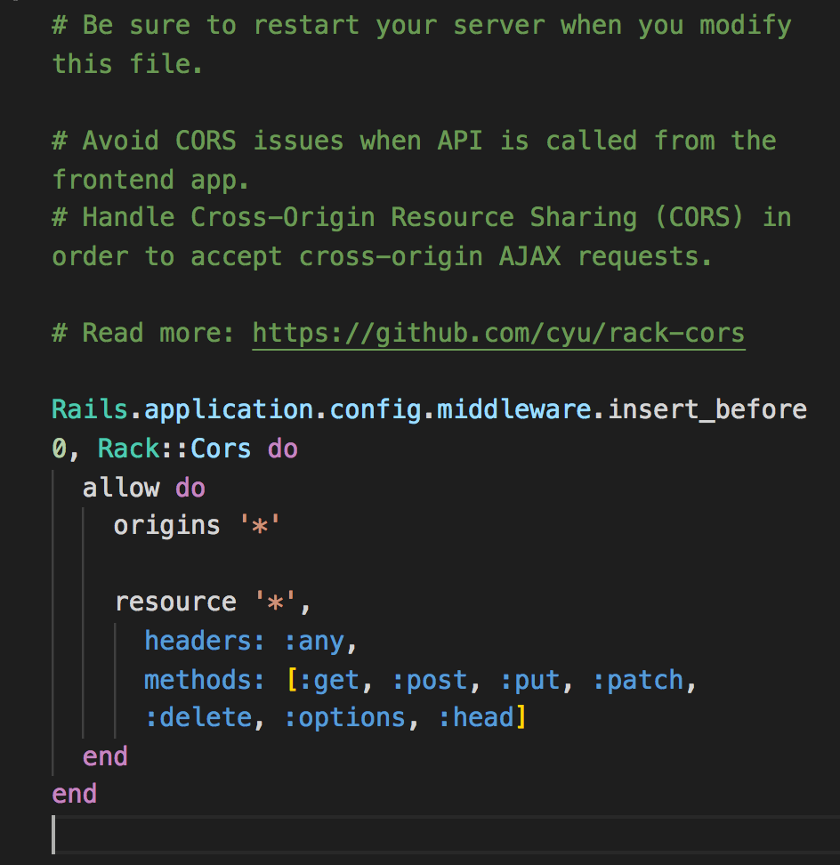

# Wildlife Tracker

Welcome to Wildlife Tracker! This app allows you to login and keep track of different wildlife you may run into in Colorado. Add the different animals you have seen and mark the location of where you saw them. Enjoy the images, descirptions, endangergement status, and information about approachability for each animal. 

## Gems Needed: 
- rails
- bcrypt
- rack-cors 
- lite-server

## How to Install Gems: 
- In your terminal run: bundle install
- For rack-cors: 
    - go to config/initializers/cors.rb
    - uncomment out and make sure origins is set    to '*'
    - 
## Running the Program
1. Open the 'wildlife tracker' repo in your terminal and run 'rails s' 
2. In another terminal open up wildlifeTrackerFrontEnd folder and run 'lite-server'

## Contributors
This app was built by Cody Shaben and Catherine Clause. If you want to access this app, you can clone from: https://github.com/codyshaben/wildlife-tracker .
    
